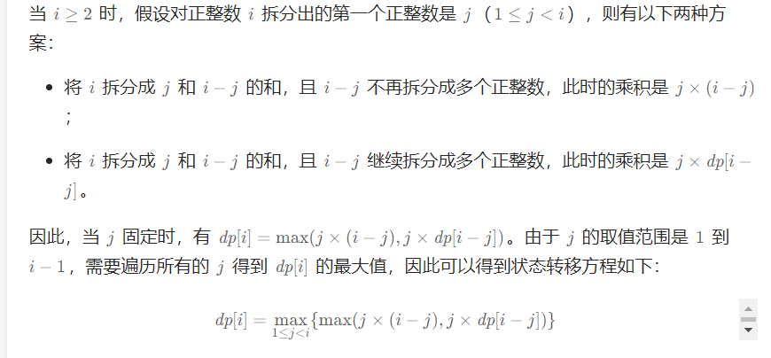

# 丑数

### 动规递推计算第n个丑数

动规，已得的丑数乘以a, b, c, d...中的其中一个，一定能找出下一个丑数。

记录 n 个下标，设已有m个丑数

从前面的存储丑数递推出后面的丑数，对对应的下标乘以对应的因子,在乘积里找最小的作为最新的丑数插入到丑数数组的后面，并且对应的因子下标加一（由于是从1开始递推生成的所以乘积一定大于第m个丑数，不用再额外考虑乘积是否大于第m个丑数）（因子下标的作用是避免用不上的计算，每次都从该因子产生过的最大的乘积对应的下标开始，在这个下标之前的都已经生成过了不用管了）。

### 二分查找+容斥定理找出第n个丑数

容斥定理能找出一个数范围内有多少个丑数，然后二分查找到1\~x中恰好有n个丑数的丑数。

容斥定理算丑数个数：long count = x/a + x/b + x/c - x/lcm\_ab - x / lcm\_ac - x / lcm\_bc + x / lcm\_abc;

lcm为最小公倍数。

m除以n就能得到范围内有多少个n的倍数：每n个数里一个n的倍数，n,n+1, n+2, ....... 2n, 3n, .....m

右边界：不会超过 n \* 最小因数

二分：第n个丑数一定是第一个能包含n个丑数的数，找到第一个就行。

