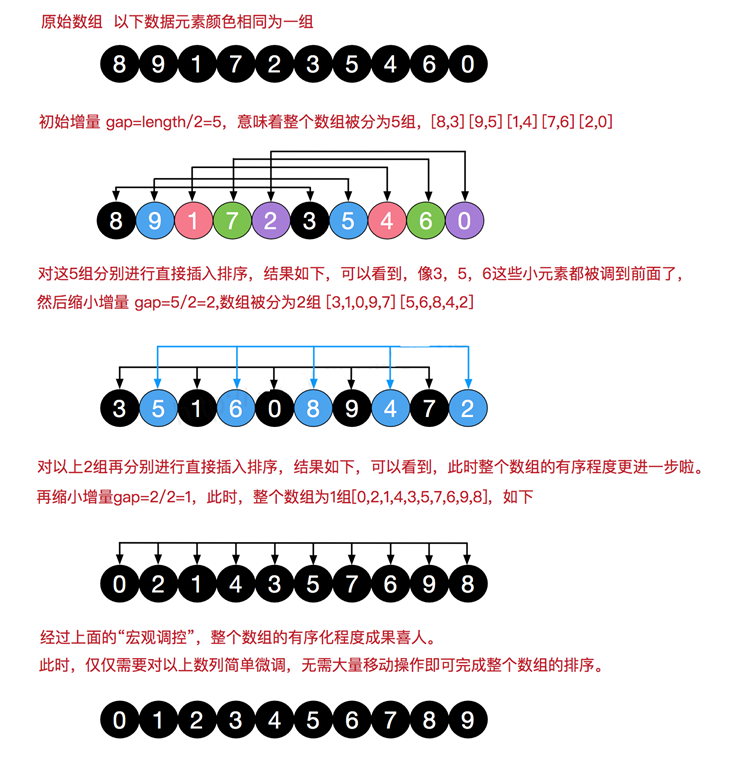

# 希尔排序（缩小增量排序）

<figure><figcaption></figcaption></figure>

````
```cpp
#include "algorithm"
#include "vector"
#include "iostream"

void shellsort(std::vector<int> &nums) {
    int i, j, gap;
    auto sz = nums.size();
    // gap 表示步长
    for (gap = sz/2; gap > 0; gap /= 2) {
        // 共gap个组. 用i表示组号。对每组使用直接插入排序排序
        for (i = 0; i < gap; ++i) {
            // 使用i+gap作为初始值，用j和j-gap比较，更简单的防止j越界
            // 对于只有一个数的情况，也很好的统一
            for (j = i + gap; j < sz; j += gap) {
                if (nums[j-gap] > nums[j]) {
                    int tmp = nums[j];
                    int k = j- gap;
                    // 采用将比nums[j](tmp)大的数后移的方式，将tmp移到合适的位置
                    while (k >= 0 && nums[k] > tmp) {
                        nums[k+gap] = nums[k];
                        k -= gap;
                    }
                    nums[k+gap] = tmp;
                }
            }
        }
    }
}

int main() {
    std::vector<int> nums{5, 1, 2, 7, 3, 4, 9, 8, 0, 12};
    auto sz = nums.size();
    shellsort(nums);
    for (auto i = 0; i < sz; ++i) {
        std::cout << nums[i] << "\t";
    }
    std::cout << std::endl;
    return 0;
}
```
````
